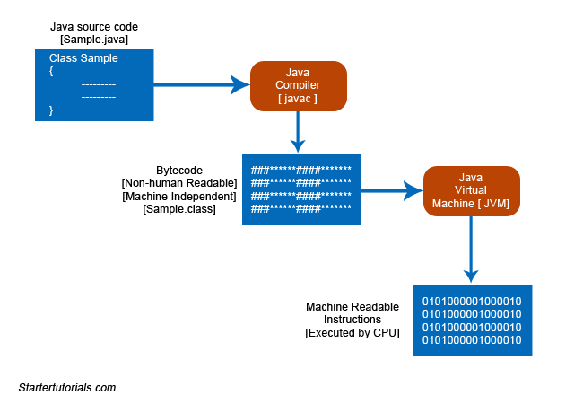

Vòng đời của một chương trình Java cho chúng ta biết những gì xảy ra ngay từ thời điểm chúng ta nhập mã nguồn vào trình soạn thảo văn bản cho đến thời điểm mã nguồn được chuyển đổi thành mã máy (0 và 1).

Có ba giai đoạn chính trong vòng đời của một chương trình Java. Đó là:
    1. Chỉnh sửa chương trình
    2. Biên dịch mã nguồn
    3. Thực thi mã byte

